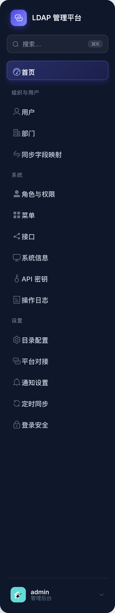
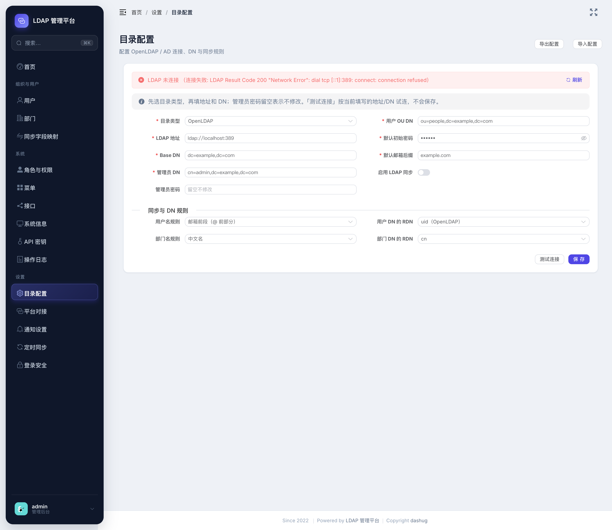
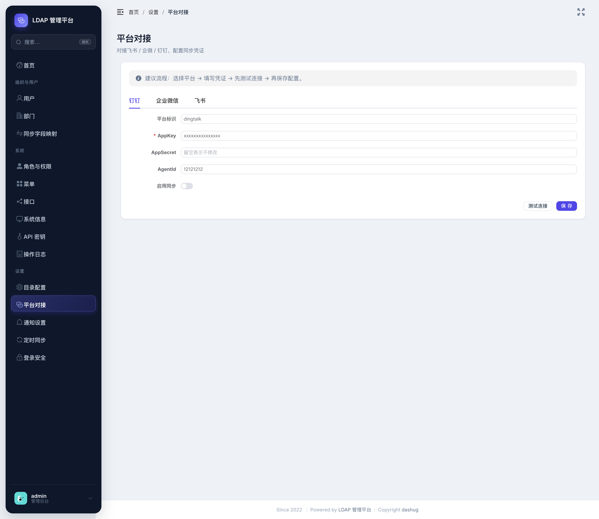
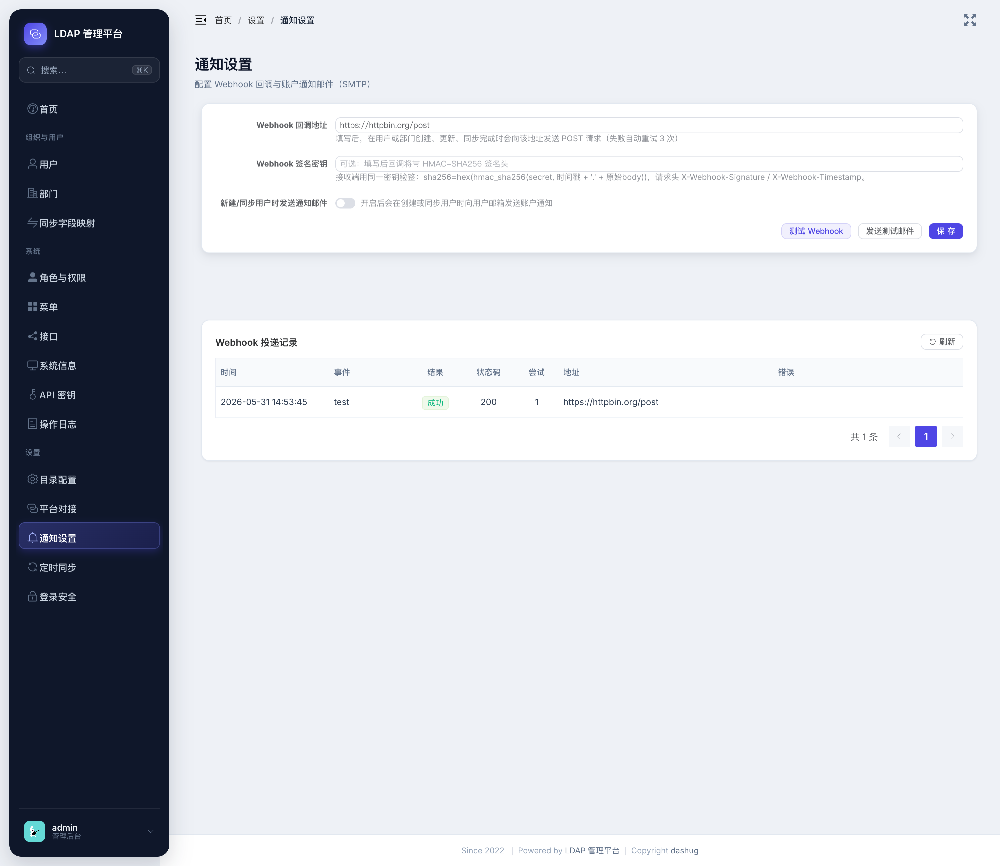
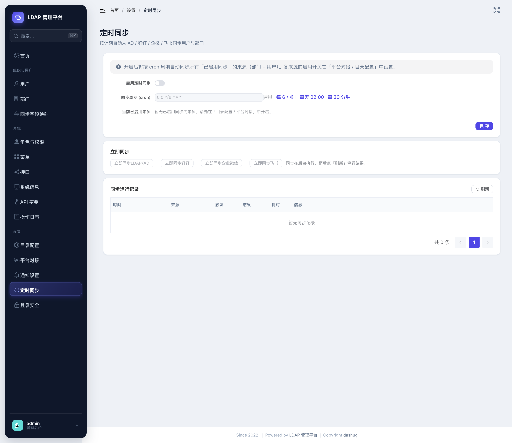
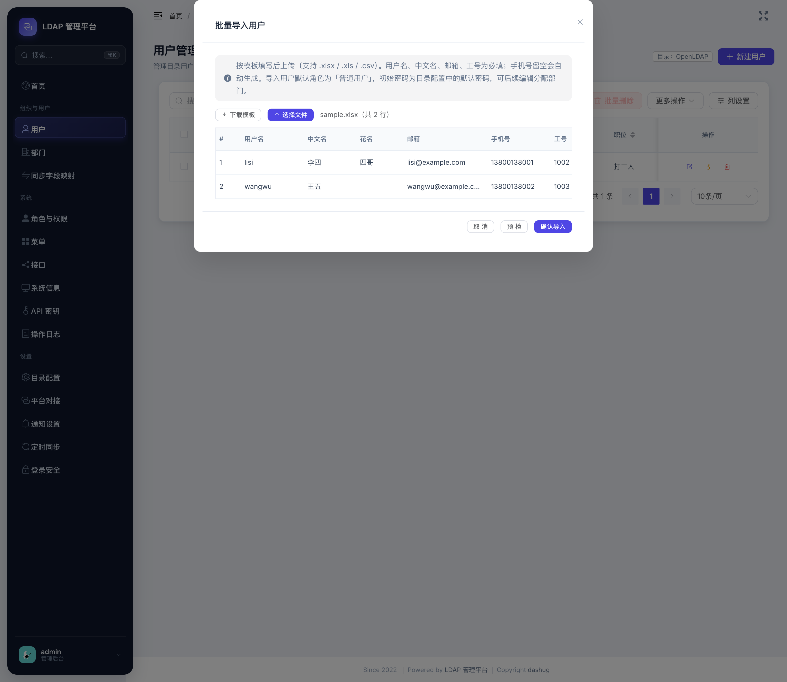
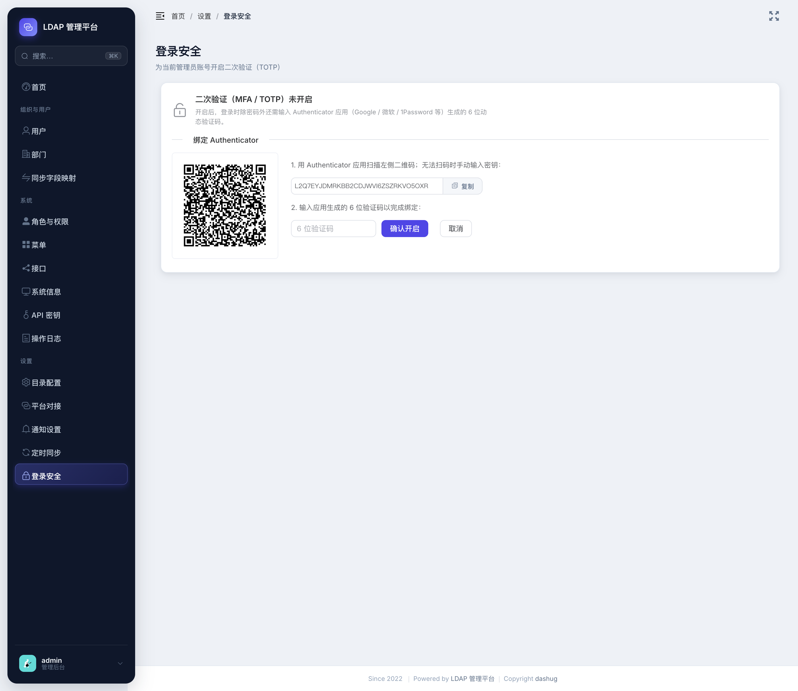
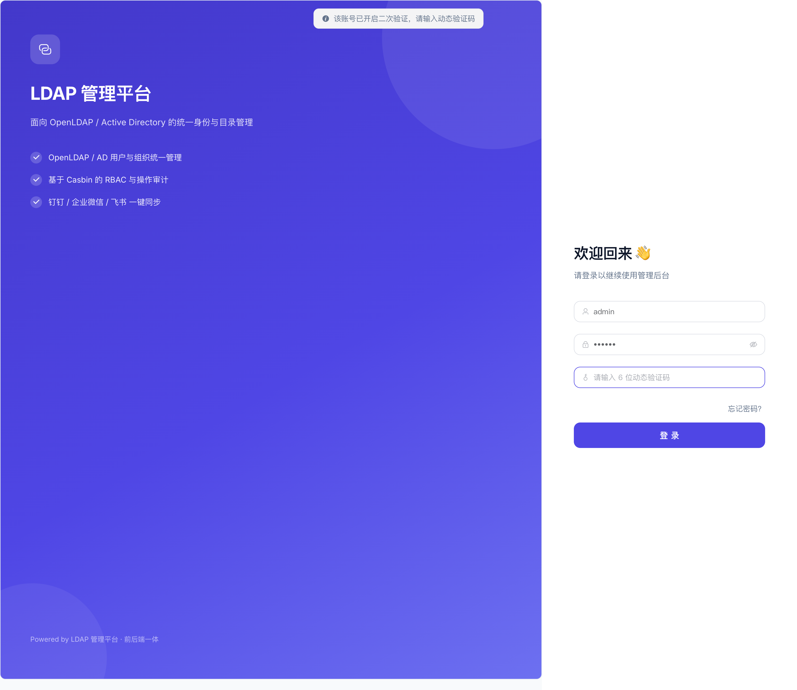

# 管理控制台使用指南

本指南介绍管理控制台中的**配置与运维能力**，包括：独立设置分区、目录/平台/通知配置、Webhook 可靠投递、定时自动同步、用户批量导入、以及管理员登录二次验证（MFA）。

> 以下功能均为**管理员**（角色 ID 为 1）可见可用；普通用户登录后看不到「设置」分区，直接访问相关页面会被拦截到 401。

---

## 功能总览

| 功能 | 入口 | 说明 |
|------|------|------|
| **设置分区** | 侧边栏「设置」/ `⌘K` | 目录配置、平台对接、通知设置、定时同步、登录安全的统一入口（独立页面，非弹窗） |
| **目录配置** | 设置 → 目录配置 | OpenLDAP/AD 连接、DN 与同步规则；实时连接状态、保存前测试连接、配置导入导出 |
| **平台对接** | 设置 → 平台对接 | 钉钉 / 企业微信 / 飞书凭证配置，支持「先测试再保存」 |
| **通知设置** | 设置 → 通知设置 | Webhook 回调（HMAC 签名 + 自动重试 + 投递记录）、SMTP 邮件、测试邮件/测试 Webhook |
| **定时同步** | 设置 → 定时同步 | 按 cron 周期自动同步各来源；立即同步、运行记录面板 |
| **批量导入** | 用户管理 → 更多操作 → 批量导入 | CSV/Excel 模板导入用户，列映射 + 预检（Dry-Run） |
| **登录安全** | 设置 → 登录安全 | 管理员账号二次验证（TOTP），扫码绑定，登录时输入动态码 |

---

## 一、设置分区入口

侧边栏底部的「设置」分区直接指向各独立设置页面（替代了早期跳转用户页弹窗的方式）。也可以按 `⌘K`（macOS）/ `Ctrl+K`（Windows）唤起命令面板，搜索「目录 / 平台 / 通知 / 定时 / 登录」快速跳转。


*侧边栏「设置」分区；以及 ⌘K 命令面板中的设置项。*

---

## 二、目录配置（OpenLDAP / AD）

**功能介绍**：配置目录类型、LDAP 地址、Base/Admin/用户 DN、默认初始密码与邮箱后缀，以及同步用户名/部门名规则与 DN 的 RDN 属性。页面顶部实时显示**当前已保存配置的连接状态**。

**使用步骤**：
1. 选择目录类型（OpenLDAP / Windows AD），填写 LDAP 地址、Base DN、管理员 DN/密码（密码留空表示不修改）。
2. 点击 **测试连接** —— 用当前**表单里填写的**地址/DN 试连，不会保存，便于保存前验证。
3. 确认无误后点击 **保存**；顶部状态横幅会刷新为最新连接结果。
4. 右上角 **导出配置 / 导入配置** 可备份或迁移目录与同步规则（导入会二次确认，避免误覆盖）。


*顶部为 LDAP 连接状态横幅，底部为「测试连接 / 保存」。*

---

## 三、平台对接（钉钉 / 企业微信 / 飞书）

**功能介绍**：在三个标签页中分别配置钉钉、企业微信、飞书的对接凭证与同步开关。密钥类字段留空表示不修改。

**使用步骤**：
1. 切换到目标平台标签页，填写 AppKey/AppSecret、CorpId/CorpSecret/AgentId、AppId 等凭证。
2. 点击 **测试连接** 验证凭证是否可用。
3. 测试通过后点击 **保存**。开启「启用同步」后，该来源即可被「定时同步 / 立即同步」使用。


*钉钉 / 企微 / 飞书标签页，支持先测试再保存。*

---

## 四、通知设置（Webhook + 邮件）

**功能介绍**：
- **Webhook 回调**：用户/部门创建、更新、同步完成时向回调地址发送 `POST`。支持 **HMAC-SHA256 签名**、**失败自动重试 3 次（指数退避）**、以及**投递记录**。
- **SMTP 邮件**：新建/同步用户时向其邮箱发送账户通知；开启后 SMTP 服务器/端口/发件人为必填并做校验。

**使用步骤**：
1. 填写 **Webhook 回调地址**；如需防伪造，填写 **Webhook 签名密钥**（留空表示不修改）。
2. 点击 **测试 Webhook** 向回调地址发送一条测试回调，结果会出现在下方「Webhook 投递记录」。
3. 如需邮件通知，打开开关并填写 SMTP 信息，点击 **发送测试邮件** 输入收件人验证可用性。
4. 点击 **保存**。


*Webhook 地址/签名密钥、SMTP 配置、测试按钮，以及底部的投递记录表。*

**接收端验签**（任选其一语言示例，伪代码）：
```
# 请求头：
#   X-Webhook-Event:     事件类型，如 user.created
#   X-Webhook-Timestamp: 秒级时间戳
#   X-Webhook-Signature: sha256=<hex>
expected = "sha256=" + hex(hmac_sha256(secret, timestamp + "." + rawBody))
assert expected == header["X-Webhook-Signature"]
```

---

## 五、定时同步

**功能介绍**：开启后按 cron 周期自动同步所有「已启用同步」的来源（部门 + 用户）。支持立即手动同步与运行记录查询。保存后**热生效，无需重启**。

**使用步骤**：
1. 打开 **启用定时同步**，填写 **同步周期（cron，6 段含秒）**，可点常用预设（每 6 小时 / 每天 02:00 / 每 30 分钟）。
2. 「当前已启用来源」显示哪些来源会被定时同步（来源开关在 目录配置 / 平台对接 中设置）。
3. 点击 **保存**。
4. 「立即同步」区可手动触发某来源（在后台执行）；在「同步运行记录」中点 **刷新** 查看来源 / 触发方式 / 结果 / 耗时 / 信息。


*定时配置、立即同步按钮、运行记录表。*

---

## 六、批量导入用户

**功能介绍**：通过 CSV/Excel 批量创建用户。导入用户默认角色为「普通用户」，初始密码取自目录配置中的默认密码，可后续编辑分配部门。

**使用步骤**：
1. 用户管理 →「更多操作」→ **批量导入**。
2. 点 **下载模板**，按列填写：`用户名*、中文名*、花名、邮箱*、手机号、工号*、职位`（带 * 为必填；手机号留空会自动生成）。
3. 点 **选择文件** 上传，下方预览解析结果。
4. 先点 **预检**（仅校验不写库，逐行返回是否可导入与原因），确认后点 **确认导入**。
5. 导入完成显示成功/失败条数，失败行列出行号与原因。


*模板下载、文件预览、预检/确认导入与结果。*

---

## 七、登录安全（MFA / TOTP）

**功能介绍**：为**当前管理员账号**开启二次验证。开启后登录时除密码外，还需输入 Authenticator 应用（Google / 微软 / 1Password 等）生成的 6 位动态验证码。该功能**默认关闭、按账号自主开启**，不影响未开启的用户登录。

**开启步骤**：
1. 设置 → **登录安全** → 点击 **开启二次验证**。
2. 用 Authenticator 应用扫描二维码（无法扫码时复制密钥手动添加）。
3. 输入应用生成的 6 位验证码，点击 **确认开启**。


*扫码绑定与验证码确认。*

**登录验证**：开启后退出再登录，密码下方会出现「动态验证码」输入框，填入当前 6 位验证码即可。


*已开启 MFA 的账号登录时需输入动态验证码。*

**关闭**：登录安全 → 关闭二次验证，需输入当前动态验证码确认本人操作。

> ⚠️ **找回**：若丢失 Authenticator 导致无法登录，可直接在数据库清除该账号的 MFA：
> ```bash
> sqlite3 data/go-ldap-admin.db "UPDATE users SET mfa_enabled=0, otp_secret='' WHERE username='admin';"
> ```

---

## 截图清单（待补充）

请按下表截图并放入 `docs/screenshots/`，文件名与下表一致即可在本文档中正确显示：

| 文件名 | 截图内容 |
|--------|----------|
| `settings-sidebar.png` | 侧边栏「设置」分区（或 ⌘K 命令面板中的设置项） |
| `settings-directory.png` | 目录配置页（含顶部连接状态横幅、测试连接按钮） |
| `settings-thirdparty.png` | 平台对接页（钉钉/企微/飞书标签页 + 测试连接） |
| `settings-notification.png` | 通知设置页（Webhook 签名密钥 + 测试按钮 + 投递记录表） |
| `settings-sync.png` | 定时同步页（cron 配置 + 立即同步 + 运行记录） |
| `user-batch-import.png` | 批量导入弹窗（预览 + 预检/导入结果） |
| `settings-security-mfa.png` | 登录安全页 MFA 绑定（二维码 + 验证码） |
| `login-mfa.png` | 登录页出现动态验证码输入框 |
